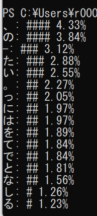

## 実行手順

1．[青空文庫](https://www.aozora.gr.jp/cards/000020/files/2569_28291.html)から文庫をテキストファイルでダウンロード<br>
2．ダウンロードしたテキストファイルをVSCodeで開く<br>
3．右下の文字コードをクリックして、「エンコード付きで保存」→「UTF-8 with BOM」で保存<br>
**_メモ帳で「名前を付けて保存」から「UTF-8(BOM付き)」で保存したがうまくいかなかった_**<br>
4．PowerShellで以下のコマンドを実行

```
$OutputEncoding = [System.Text.Encoding]::UTF8
cat aa_kazokusama.txt | node index.js
```

## 結果


