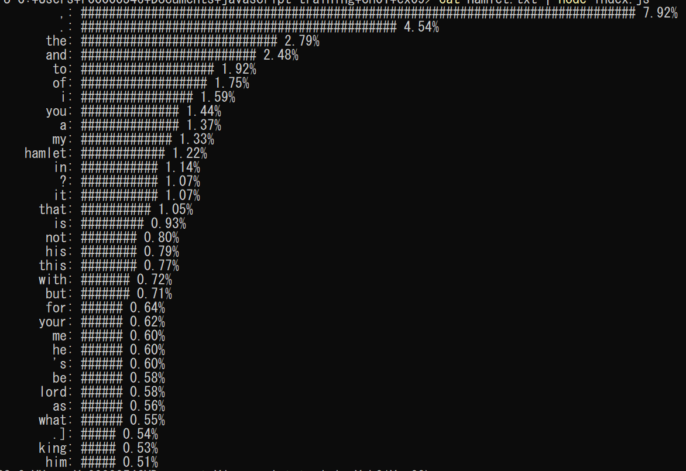
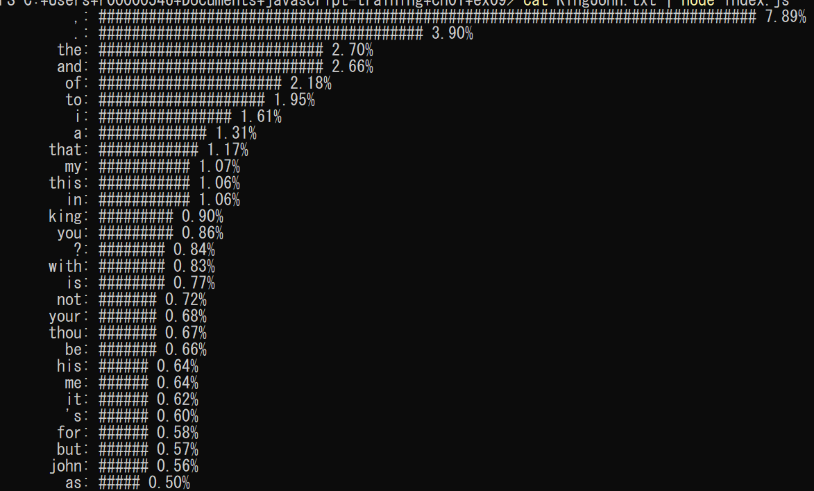

## 実行手順

1．https://www.folger.edu/explore/shakespeares-works/download からHamletとKingJohn をテキストファイルでダウンロード

2．ダウンロードしたテキストファイルをVSCodeで開く

3．右下の文字コードをクリックして、「エンコード付きで保存」→「UTF-8 with BOM」で保存

4．PowerShellで以下のコマンドを実行

```
$OutputEncoding = [System.Text.Encoding]::UTF8
cat Hamlet.txt | node index.js
cat KingJohn.txt | node index.js
```

## 結果
Hamlet


KingJohn



## 経験則の名前
Zipfの法則（https://ja.wikipedia.org/wiki/%E3%82%B8%E3%83%83%E3%83%97%E3%81%AE%E6%B3%95%E5%89%87）

出現頻度が k 番目に大きい要素が、1位のものの頻度と比較して 1/k に比例するという経験則である。