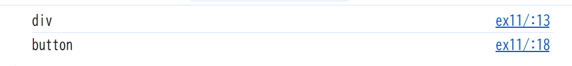
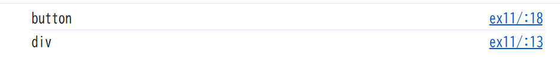
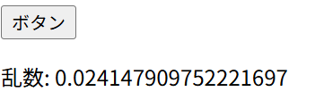
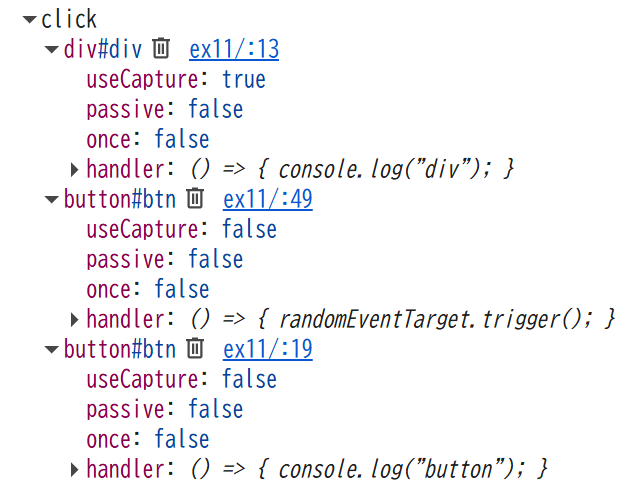

## html を開き、ボタン押下時のコンソール出力結果を確認しなさい。

divのcaptureがtrueなのでキャプチャフェーズでdivが先に処理されるため、div→button

## capture の値を変更し div と button のコンソール出力順序が逆になることを確認しなさい。

divのcaptureがfalseになると、バブリングフェーズで子→親の順番になるため、button→div

## script 中のコメント 1.～ 4.の指示に従いカスタムイベントの関連コードを完成させなさい。

## ブラウザのデバッグツール(Chrome の場合は Developer Tool の Event Listners)で、btn 等に登録されているイベントをそれぞれ確認しなさい。

