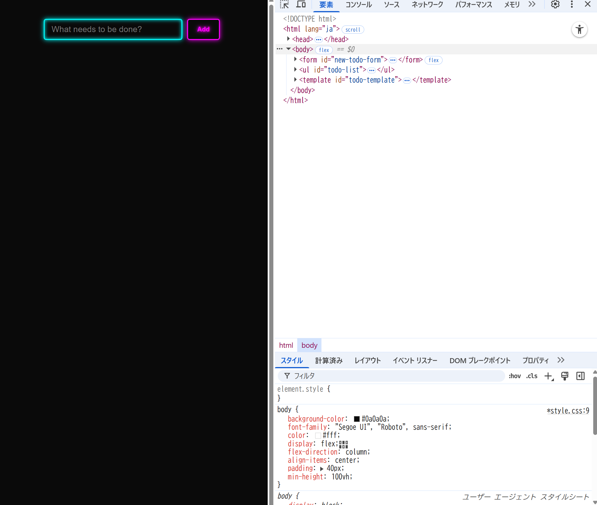
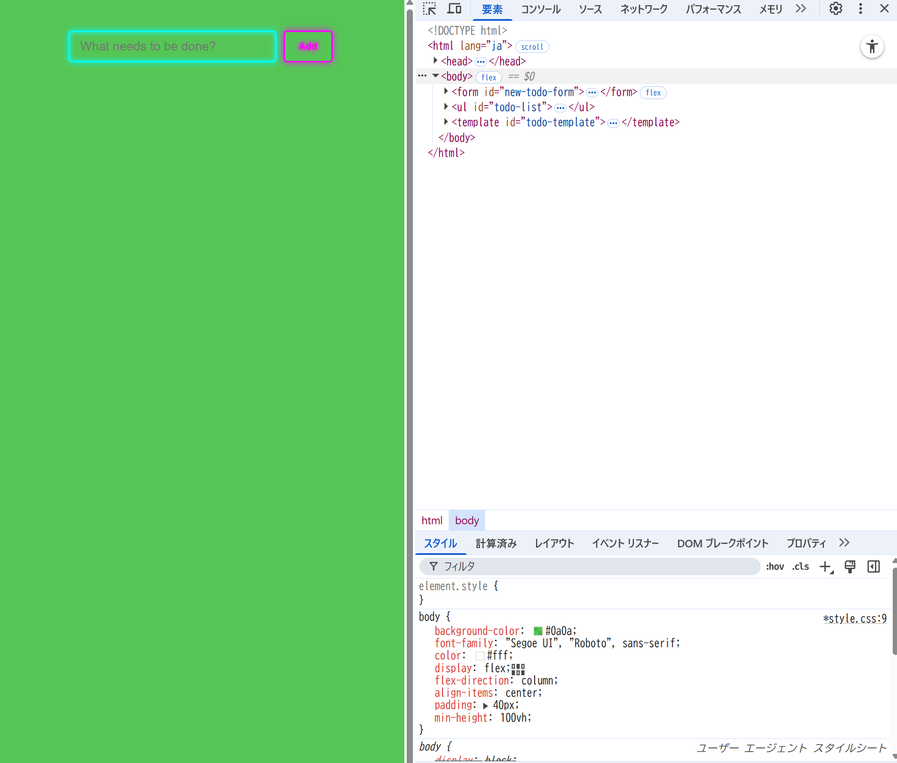
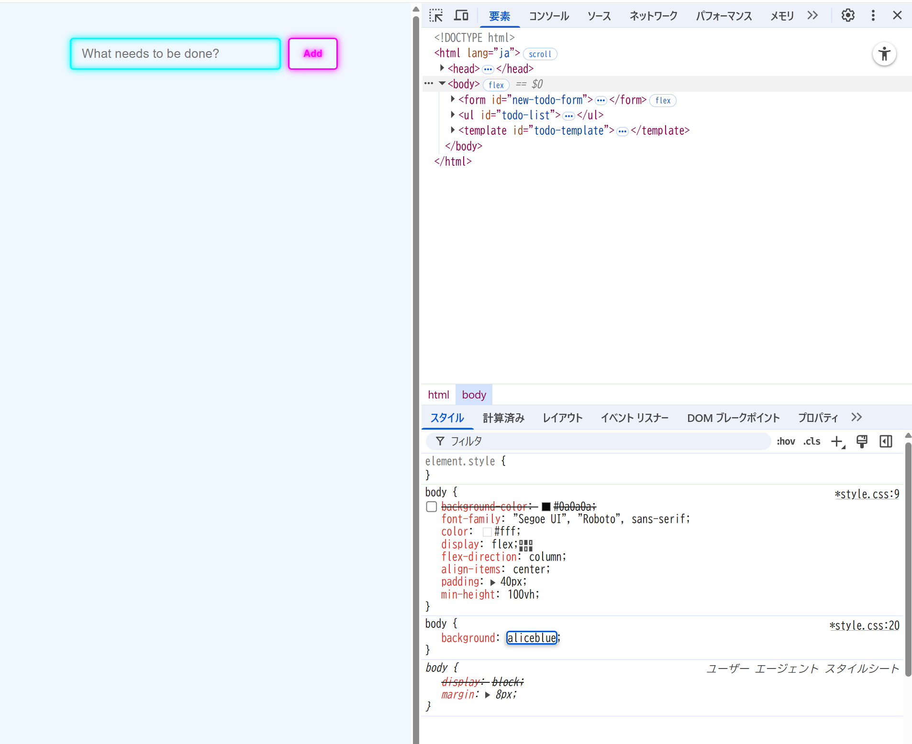

## 15.4-10.1 および 15.4-10.2 の ToDo アプリに対してブラウザの開発者ツールから値の変更やプロパティの追加を試してみなさい

- 値の変更
  変更前：
  変更後：

* プロパティの追加
  既存のbackgroundを無効化して、新たにbackgroundを追加
  

## 開発者ツールで CSS に関して実行できる操作を検索エンジンで調べ、便利だと思ったものを 3 つ挙げなさい

- プロパティの有効/無効の切り替え

  どのCSSプロパティがどのように作用しているかをデバッグできるため

- CSSの値の変更

  背景色やpaddingのpx幅などを確認しながら、設定するために役立ちそう

- スタイルの継承・上書きの確認

  同じプロパティが複数ルールで指定されているときに、どのルールが適用されているかを確認できるため。

## 15.4-10.2 のアプリの body 要素に対し、元々 HTML および JS 内で利用していなかった Tailwind CSS のクラス (bg-rose-600 など何でも良い) を開発者ツールから追加すると変更が反映されないが、これは何故か調べなさい

Tailwind は 必要なクラスだけを CSS として出力 する仕組み。

そのため、ビルド時にHTML や JS ファイル内で使われているクラスだけをスキャンして、対応する CSS を生成する。

開発者ツールで追加したクラスはビルド時にHTMLに存在しなかったため、対応するCSSが生成されていない。

その結果、開発者ツールでクラスを追加しても、反映されない。
