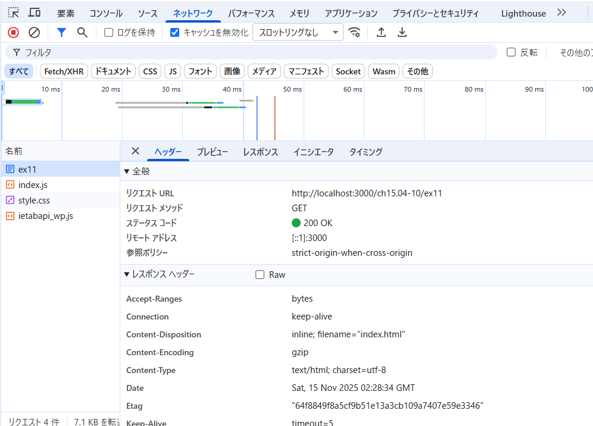
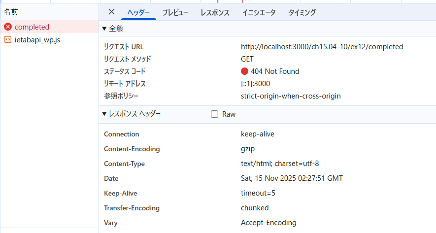

## Active や Completed を選択後にブラウザのリロードを行うとどうなるだろうか。hashchange と pushState それぞれの実装について調べなさい

### hashchange

URL の # 以降（ハッシュ）は ブラウザがサーバに送信しない

ブラウザのリロードをしても、サーバには http://localhost:3000/ しかリクエストされない

ページは再読み込みされるが、ハッシュの値は window.location.hash で取得できるので、JavaScript 側で状態を復元できる

### pushState

ブラウザをリロードすると、サーバに /active というパスで GET リクエスト が送られる

サーバがそのパスを返すルートを持っていないと 404 エラー になる

## サーバー側がどのような挙動をすれば pushState を使った実装が期待通り動作するか考えて答えなさい。

リクエストされたパスに対応する静的ファイル（CSS/JS/画像など）がある場合 → そのファイルを返す

ファイルが存在しない場合 → index.html を返す

クライアント側の JavaScript が URL を見て画面をレンダリングする
