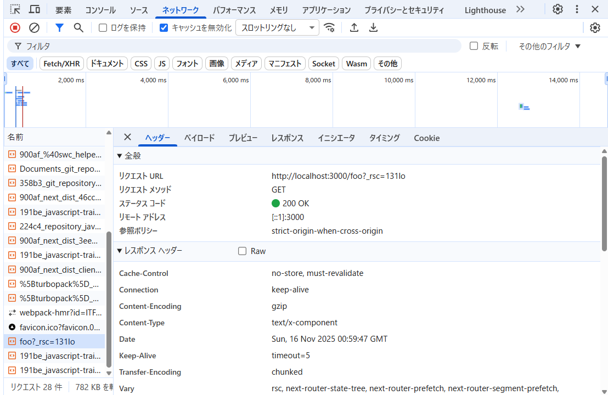

## 以下の動作を確認しなさい

### ブラウザの開発者ツールの「ネットワーク」タブを確認してみよう。リンクをクリックしたときに通信は発生しているだろうか？

barのLINKをクリックした結果は以下。以下を取得し、差分を描画する。(全描画ではなく、必要なとこだけ描画したい)

1. fooのサーバーコンポーネントのデータを取得（RSC Fetch）
2. fooのクライアント側で実行される JavaScript のチャンクを読み込む

サーバーコンポーネントとは、サーバーで実行される React コンポーネントのことで、page.tsxはこれに含まれる。

特別なことをしなければ ページは基本的にサーバーコンポーネント。

JS チャンクとはブラウザで実行される JavaScript の分割されたファイル。

今回だとnext/link はpushState するために、内部でクライアント側 JS を使う。pushStateはブラウザの機能なので、サーバーだけで実行できない。そのため、JSチャンクとしてブラウザで実行する必要がある。

そのため、Server Component 内に Client Component が埋め込まれている状態になり、JSチャンクを取得する必要がある。

### pushState はいつ実行されているだろうか？

クリックされた直後に実行されている。

### リロード時に画面の表示はどうなるだろうか？

リロード時には遷移先のページがそのまま表示されるだけ。

通常のHTTPリクエストがサーバに飛ぶだけなので、RSC Fetchなどは発生しない。

##　1 で確認した動作と 15.4-10.12 で確認した動作を比較し、next.js の Link でどういった処理が行われているかをまとめなさい。

next.jsのLinkで行われている処理

1. クリック直後に pushState を実行 → URL が変わる
2. RSC Fetch → サーバーコンポーネントの差分データを取得
3. 必要 JS チャンクの取得 → クライアントで描画/イベント処理可能に
4. React が画面を更新 → フルリロードなしで SPA 的遷移完了
5. リロードしたときは遷移先のフル HTML を取得 → SPA 遷移時とは異なり、RSC Fetch は発生しない
