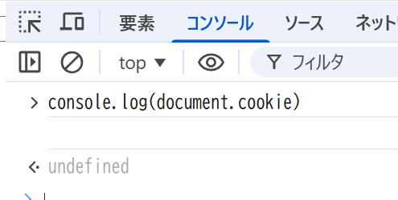
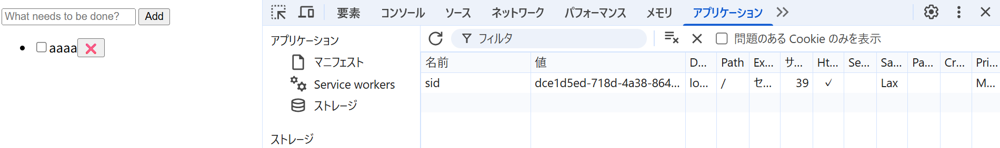

## 問題

このサーバでは Cookie を使ってクライアントのセッションを識別し、タスク一覧をセッションごとに分離して管理する簡易的な認証/認可を行っている。サーバが設定している Cookie の値は sid=<セッションに一意に割り当てた ID>; SameSite=Lax; Path=/; HttpOnly; である。ToDo アプリでいくつかのタスクを作成した後、以下に挙げる操作を実施したとき、それぞれどのような結果になるか記載し、その理由を説明しなさい。

### index.js でdocument.cookie プロパティを console.logで表示する

#### 結果

#### 理由

HttpOnlyが付いたCookieは以下のセキュリティ仕様であるため

- JavaScriptから読みない
- document.cookieに現れない
- 読めないがサーバへリクエスト時は自動で送信される

### ブラウザの開発者コンソールで http://localhost:3000/ の Cookie を表示する

#### 結果

#### 理由

HttpOnly は JavaScript からのアクセスを禁止するためのものであって、
ブラウザ自身（DevTools）が Cookie を表示することは制限しないため。

### ToDo アプリのタブをリロードする

#### 結果

リロード前のタスクが表示されたまま

#### 理由

同じタブで同じURLを読み込む場合、同一 Cookie（sid）を保持したまま API にアクセスするため。

### 同一ブラウザの異なるタブやウィンドウで http://localhost:3000/ を開いて ToDo リストの状態を確認する

#### 結果

異なるタブでも異なるウィンドウでも同じタスクが表示される

#### 理由

同一ブラウザは 同じ Cookie を共有するため

### シークレットウィンドウや異なるブラウザで http://localhost:3000/ を開いて ToDo リストの状態を確認する

#### 結果

シークレットウィンドウや異なるブラウザで開いたとき、初期状態のToDOリストが表示される

#### 理由

シークレットウィンドウや別ブラウザは
Cookie ストレージを共有しないので、新しい sid が発行され、別セッション扱いとなるため。

### http://127.0.0.1:3000/ を開いて ToDo リストの状態を確認する

#### 結果

初期状態のToDOリストが表示される

#### 理由

Cookie は ドメインごとに別管理されるため、異なるドメインの場合は別セッション扱いとなる。
