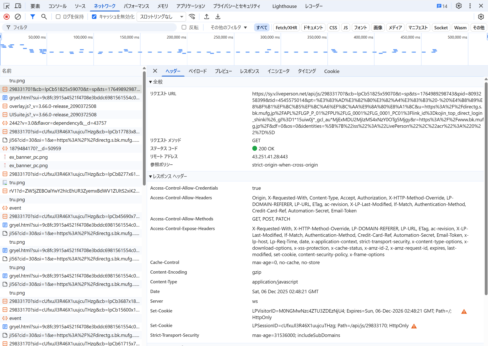

## 実際のサービスの通信をデベロッパーツールなどで眺めて CORS の設定を確認しなさい。

三菱UFJのログインページ

https://directg.s.bk.mufg.jp/APL/LGP_P_01/PU/LG_0001/LG_0001_PC01?link_id=kojin_top_direct_login_shinki&_gl=1*15uiw0j*_gcl_au*MjExMDU2MjIzMS4xNzY0OTg5Mjgy

GETリクエストのレスポンスヘッダーにCORS関連のものが返ってきている

- Access-Control-Allow-Credentials: true

  → 認証情報（Cookieなど）をクロスオリジンで送信可能にする設定。

- Access-Control-Allow-Headers:

  Origin, X-Requested-With, Content-Type, Accept, Authorization, X-HTTP-Method-Override, ...

  → クライアントが送信できるヘッダーの一覧。

- Access-Control-Allow-Methods:

  GET, POST, PATCH

  → 許可されているHTTPメソッド。

- Access-Control-Expose-Headers:

  → クライアント側でアクセス可能なレスポンスヘッダー。

  
