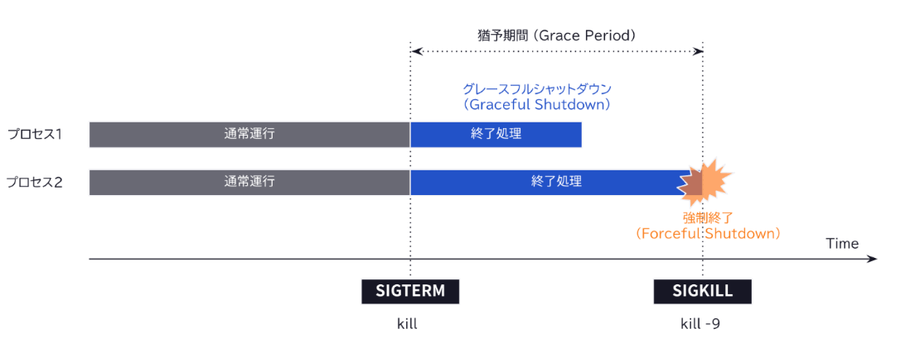

## ランタイム上でコンテナの Graceful Shutdown のために送信されるシグナルの種類は何か書きなさい。

### Graceful Shutdownとは

ステムやアプリケーションを停止させる際に、現在の処理やタスクを可能な限り安全に完了させ、リソースの解放を適切に行いながら停止する一連の流れ。
データ損失やシステムの不整合を防ぎ、ユーザー体験やシステムの安定性を保つために重要。

### Graceful Shutdownの流れ

引用：https://zenn.dev/loglass/articles/348886ded0f0bd

### Graceful Shutdownで送信されるシグナル

- SIGTERM→初めに送るコンテナへの終了依頼シグナル
- SIGKILL→猶予時間内にコンテナが終了しない場合の強制終了シグナル
