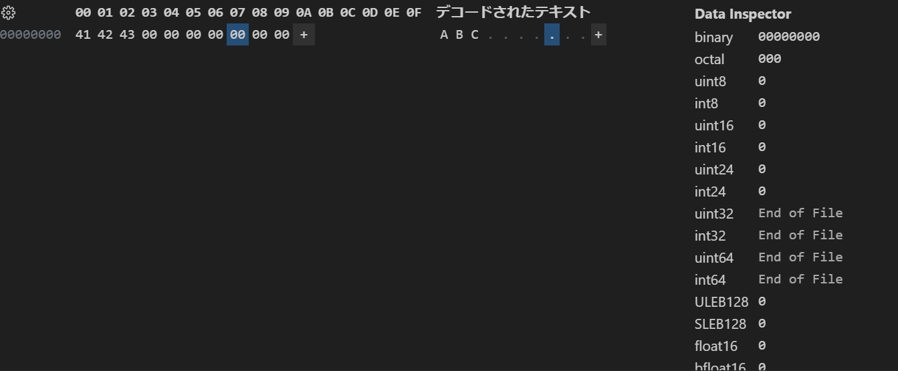

## fs.truncate() を利用してファイルを拡張し、拡張されたファイルの内容をバイナリエディタ(Stirling や VSCode の HexEditor 拡張機能等)で確認しなさい

### 確認方法

1. index.cjsを実行して、拡張したファイル(sample.bin)を生成
2. VSCodeの拡張機能で"Hex Editor"をインストール
3. sample.binを右クリックして、"ファイルを開くアプリケーションの選択"から"Hex Editor"を選択
   4．拡張された箇所がどのような値となっているか確認する　

### 結果

実行結果としては、拡張される際に埋められる0はASCIIの0(0x30)ではなく、ASCIIのNULL(0x00)だった

