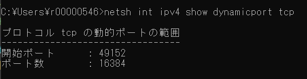

## 実行結果

16269

## 理由

ephemeral port 枯渇によって接続が失敗する。

Windows11のクライアント側の送信元TCPポート数は16384(65535~49152)である。
https://learn.microsoft.com/ja-jp/troubleshoot/windows-server/networking/default-dynamic-port-range-tcpip-chang?utm_source=chatgpt.com

実際に確認したところ、以下の結果となった。

今回の実行結果との微妙な差の原因としては以下が考えられる。

- 他アプリ（ブラウザ等）が使っている ephemeral port
- OS 自身が確保している TCP 接続
- Node / Windows TCP スタックの内部予約・競合
