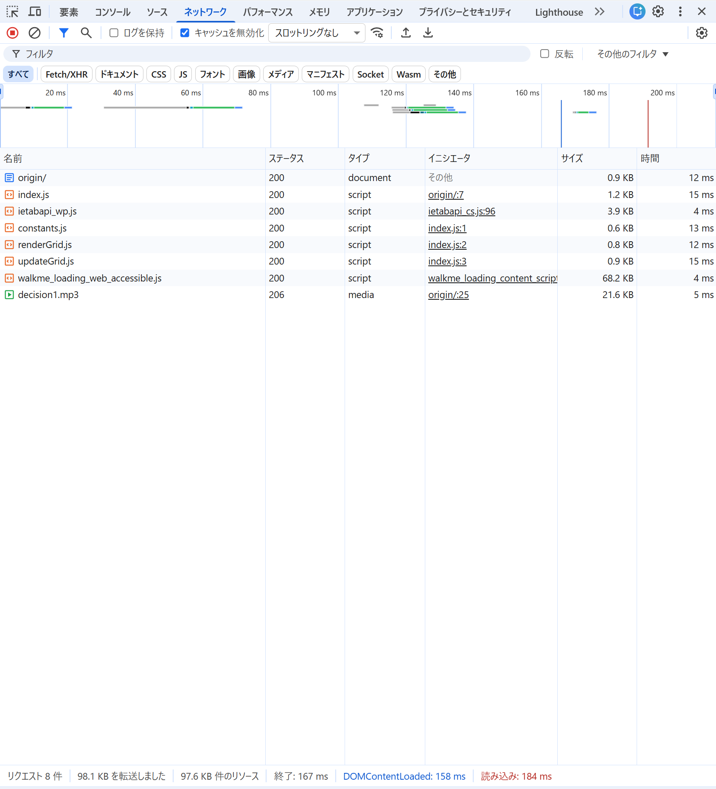
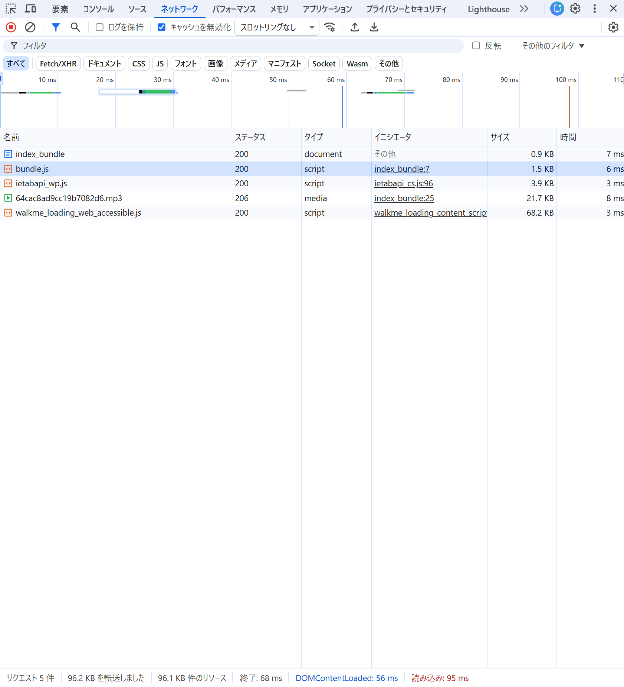

## 実行コマンド
`npx webpack --mode=production --entry ./ex05/src/index.js --output-path ./ex05/dist --output-filename bundle.js
`

## バンドル実行結果
- origin : バンドル前のファイル群
- bundle : バンドル後のファイル群

## バンドルしたコードと元のコードを比較し、どのような処理が行われたかを確認しなさい。
- 複数の ES モジュールが 1 つのファイルにまとめられている

    index.js, renderGrid.js, updateGrid.js, constants.js を含むすべてのモジュールが即時実行関数（IIFE） に統合されている。
    これによりブラウザ側は複数ファイルを読み込む必要がなくなり、HTTP リクエスト数が削減された。

- mp3 ファイルが別に出力され、webpack が参照パスを自動解決している

    mp3 はビルド時に dist フォルダへコピーされ、ハッシュ付きのファイル名（例：64cac8ad9cc19b7082d6.mp3）に変換されている。
    
    JS 内の音声読み込みは new URL(<生成されたファイル名>, baseURI) のように書き換えられ、最終的な実ファイルの URL を確実に参照できるように処理されている。

- 変数名の短縮・定数のリテラル展開などの最適化（minify）が行われている

    ROWS や COLS のような定数は 50 などの数値に直接置き換えられ、変数名も o, c, a のように短縮。
    改行や余分な空白も削除され、ファイル容量が小さくなり、ブラウザでの読み込みが高速化している。
## バンドル前後それぞれのコードを利用するページをローカルサーバで配信してブラウザから閲覧できるようにしなさい。開発者ツールで ネットワーク タブを開き、スクリプトのダウンロード時間、ページの読み込み完了時間について比較しなさい。

バンドル前は index.js, constants.js, renderGrid.js, updateGrid.js のように複数の JavaScript ファイルを個別にダウンロードする必要があり、
HTTP リクエストが複数発生するため、結果としてページ全体の読み込み時間（Load）が長くなった。
一方バンドル後は、JavaScript が bundle.js 1 本にまとめられているため、HTTP リクエストが 1 回で済む。
さらに webpack の production ビルドにより コード圧縮（minify）や定数の値埋め込み（inline）などの最適化が行われ、ファイルサイズが小さくなった。
そのため、JavaScript のダウンロード時間もバンドル前より短くなり、ページ全体の読み込み時間も短縮された。

- バンドル前

- バンドル後
