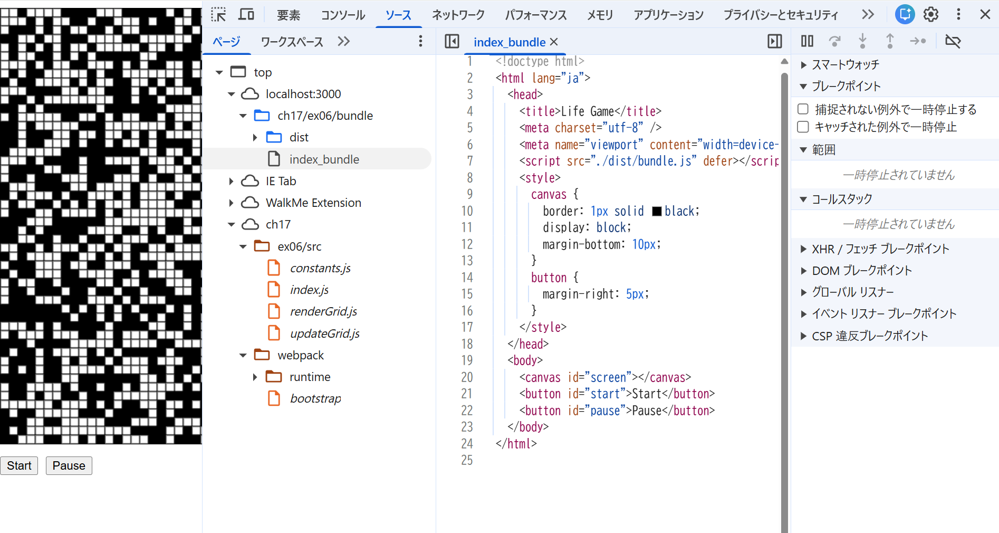
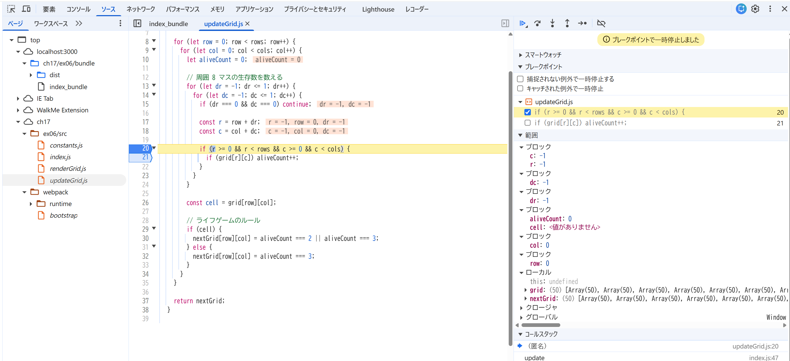

## 実行コマンド
`npx webpack --mode=production --entry ./ex06/src/index.js --output-path ./ex06/dist --output-filename bundle.js --devtool source-map
`

## 開発者ツールで ソース タブ(Chrome, Edge, Safari) または デバッガー タブ(Firefox) を開き、ソースコードファイルがどのように表示されるかを確認しなさい。

## バンドルしたコードの実行中に、バンドル前のソースコードファイルに基づいたブレークポイントの設定や変数の値の確認等のデバッグが可能か確認しなさい。
